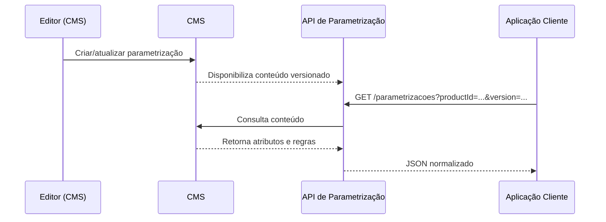

import Tabs from '@theme/Tabs';
import TabItem from '@theme/TabItem';

<div style={{
  background: 'linear-gradient(135deg,#fce0d8 0%,#fce3ec 25%,#e7d7f8 50%,#d5e4fa 75%,#d6f4f9 100%)',
  borderRadius: 24,
  padding: '2rem',
  boxShadow: '0 8px 24px rgba(0,0,0,.08)',
}}>
  <div style={{
    background: '#ffffffcc',
    backdropFilter: 'blur(6px)',
    borderRadius: 16,
    padding: '1.5rem',
    border: '1px solid #eaeaea',
  }}>
    <h1 style={{margin: 0, fontSize: '2rem'}}>Parametrização de Produtos</h1>
    <p style={{marginTop: '.5rem'}}>
      Guia prático para entender, criar e consumir parametrizações de produtos.
      As parametrizações são cadastradas no <strong>CMS</strong>, e a <strong>API</strong> consulta essas informações para retornar dados estruturados às aplicações.
    </p>
  </div>
</div>

## Visão Geral

**Parametrização de Produtos** é o conjunto de atributos, regras e variações que descrevem “como” um produto deve se comportar em diferentes contextos (canal, público, campanha, versão, etc.).
A criação e manutenção acontece no **CMS**; a **API** apenas **lê** e **entrega** o conteúdo de forma padronizada.

### Onde tudo começa: CMS
O **CMS (Content Management System)** é a fonte de verdade. Nele você cadastra:
- Identificadores (ex.: `productId`, `sku`, `version`).
- Atributos e variações (ex.: limites, taxas, franquias, prazos).
- Regras de habilitação/eligibilidade (ex.: canal, segmento, datas de vigência).
- Metadados (ex.: status, rótulos, owner, timestamps).

A **API** consulta o CMS e retorna as parametrizações de forma **estável** e **normalizada**, garantindo consistência entre canais.

## Fluxo End‑to‑End



## Estrutura de Dados (exemplo)

> O contrato abaixo é um **exemplo base** para orientar o consumo. Ajuste nomes/campos conforme seu contrato real.

```json
{
  "productId": "cartao-black",
  "version": "2025-08-01",
  "status": "active",
  "effective": { "start": "2025-08-01", "end": null },
  "context": {
    "channel": ["app","web"],
    "segment": ["prime","vip"],
    "locale": "pt-BR"
  },
  "attributes": {
    "annualFee": 1200.00,
    "minimumIncome": 15000.00,
    "rewards": { "type": "pontos", "ratio": 2.2 },
    "limits": { "cashAdvance": 5000, "credit": 60000 }
  },
  "rules": [
    {"name": "Elegibilidade renda", "condition": "income >= 15000"},
    {"name": "Canal habilitado", "condition": "channel in ['app','web']"}
  ],
  "metadata": {
    "createdBy": "ofertas@empresa.com",
    "createdAt": "2025-08-10T21:30:00Z",
    "labels": ["campanha-primavera","alto-valor"]
  }
}
```

## Endpoints (padrão)

<Tabs>
  <TabItem value="listar" label="Listar parametrizações">
  
**GET** `/v1/parametrizacoes`

Parâmetros comuns: `productId`, `version`, `status`, `channel`, `segment`, `locale`, paginação.

```bash
curl -X GET "https://api.seudominio.com/v1/parametrizacoes?productId=cartao-black&status=active"
```

  </TabItem>
  <TabItem value="buscar" label="Buscar por ID">

**GET** `/v1/parametrizacoes/{productId}`

```bash
curl -X GET "https://api.seudominio.com/v1/parametrizacoes/cartao-black?version=2025-08-01"
```

  </TabItem>
  <TabItem value="resolver" label="Resolver por contexto">

**POST** `/v1/parametrizacoes/_resolve`

```bash
curl -X POST "https://api.seudominio.com/v1/parametrizacoes/_resolve" \
  -H "Content-Type: application/json" \
  -d '{
    "productId": "cartao-black",
    "context": { "channel":"app", "segment":"prime", "locale":"pt-BR" }
  }'
```

  </TabItem>
</Tabs>

## Boas Práticas de Cadastro (CMS)

- **Versione sempre** (`version` semântica ou por data). Não edite versões “imutáveis”.
- **Datas de vigência** claras (`effective.start/end`) para evitar colisões.
- **Padronize nomes** de atributos e unidades (ex.: `annualFee` em BRL/ano).
- **Evite lógica no front**. Regras vivem no CMS; o cliente apenas consome.
- **Use rótulos/labels** para agrupar (campanhas, segmentos, experimentos).
- **Auditoria**: preencha `metadata` (autor, data, justificativa).

## Validação & Qualidade

- **Consistência**: garanta chaves obrigatórias (`productId`, `version`, `status`, `attributes`).
- **Schema**: valide tipos e faixas (ex.: limites ≥ 0).
- **Contexto**: evite sobreposição de regras para o mesmo canal/segmento.
- **Testes**: crie casos de _resolve_ por canal/segmento/version para evitar regressões.

## Erros Comuns da API (exemplos)

| Código | Cenário | Ação sugerida |
|---|---|---|
| 400 | Parâmetro inválido | Revise `productId/version/channel`. |
| 404 | Parametrização não encontrada | Verifique vigência e status no CMS. |
| 409 | Conflito de versões | Ajuste `effective` e labels de campanha. |
| 500 | Falha ao consultar CMS | Tente novamente e monitore o CMS/integração. |

## Troubleshooting Rápido

- **Retorno vazio**: verifique `status=active` e `effective.start/end` no período.
- **Atributo faltando**: confirme schema no CMS e pipeline de publicação.
- **Canal sem regra**: inclua em `context.channel` e re‑publique.
- **Diferença entre canais**: audite labels/campanhas aplicadas.

## FAQ

**Posso editar uma parametrização publicada?**  
Prefira criar **nova versão** e encerrar a anterior via `effective.end`.

**Como habilitar por campanha?**  
Use `labels` ou um campo específico de campanha e filtre no consumo.

**Onde implementar regras de negócio?**  
No **CMS**. A API deve **servir** as regras, não reescrevê‑las.

---

> **Observação:** Esta página foi gerada a partir das imagens fornecidas, mas sem OCR automático nesta versão. Caso precise, forneça os campos-chave e eu refino o contrato e exemplos conforme o seu padrão real.
